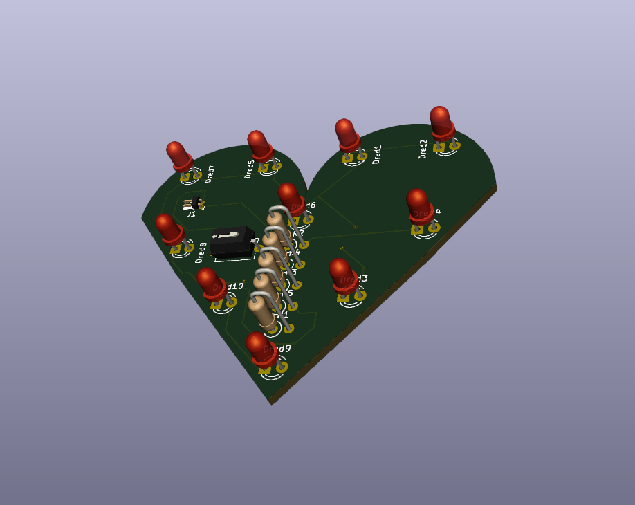

# Heart LED PCB
This is a simple PCB, designed to be in the shape of heart. There is a SPST switch for turning on/off the power. It is powered by a battery of 9V. Resistor values are adapted for red LEDs. Color changing requires resistor dimensioning.
